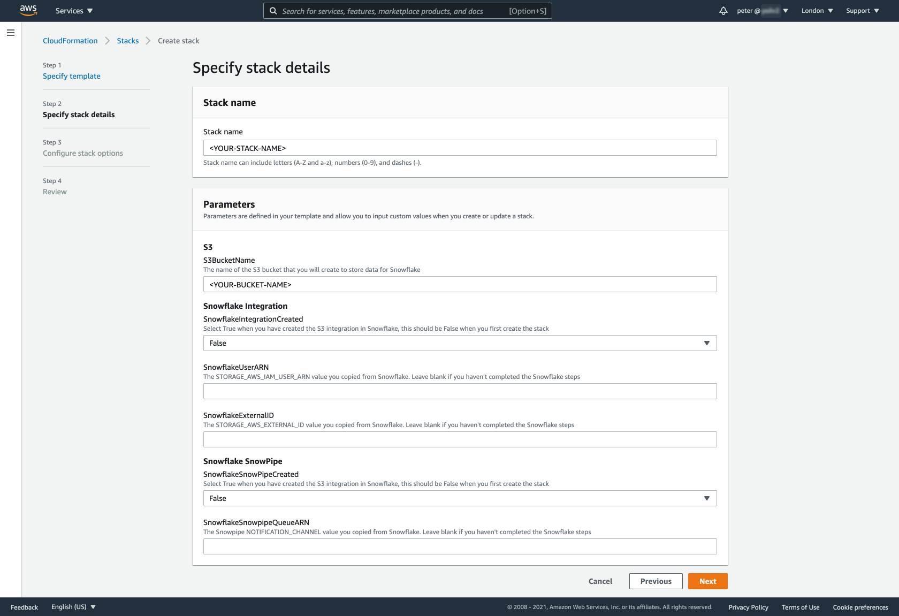
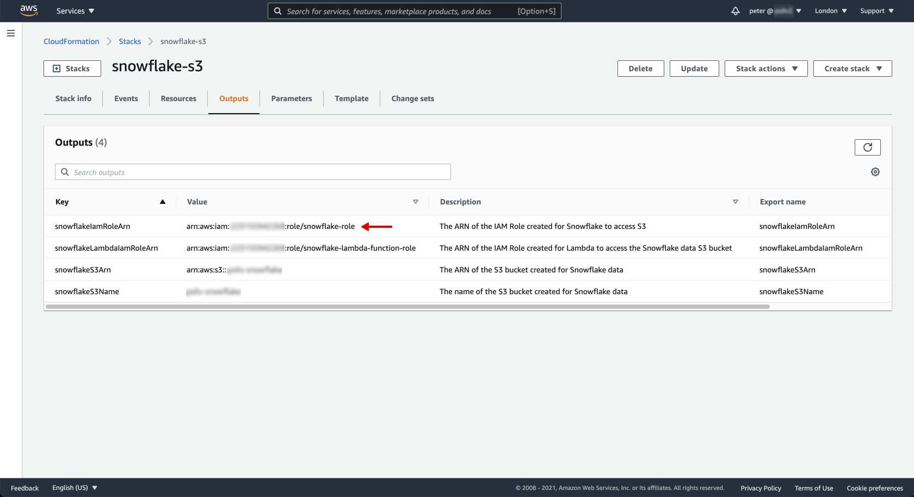
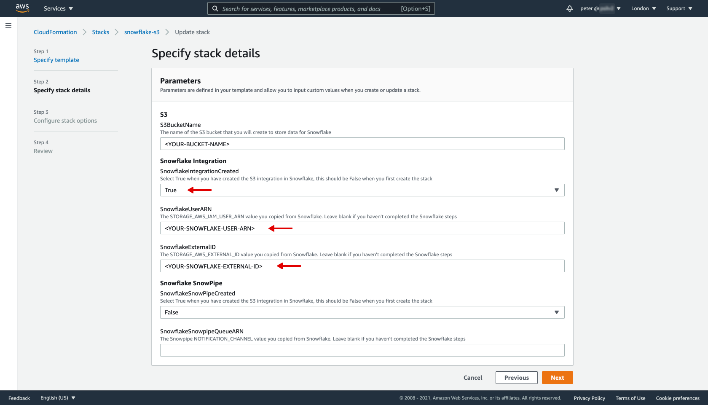
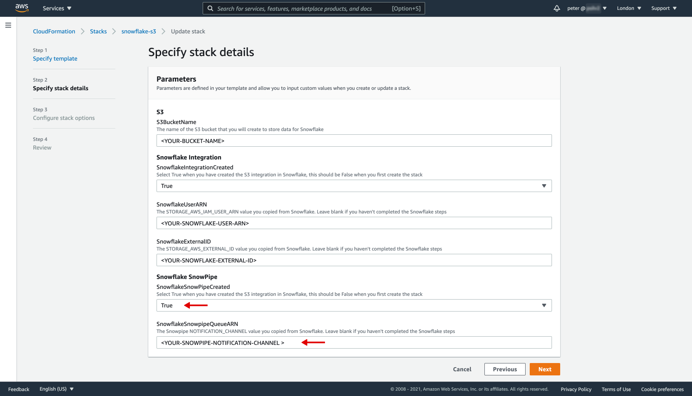

# Snowpipe

## Prerequisites

- Snowflake Account
  - Permissions to create resources (databases, schemas, stages etc.)
- AWS Account
  - Permissions for CLoudFormation, IAM, S3, Lambda

## Steps

### 01 - Create S3 Bucket

The first thing to create is the S3 bucket that will store your data to be read into Snowflake. The [cfn_s3.yaml](cloudformation/templates/cfn_s3.yaml) template makes this set up easy. Use either the AWS console or the AWS CLI via the [deploy script](cloudformation/scripts/deploy_s3.sh) to create the CloudFormation stack.

When first creating the stack the parameters will be as below (you will need to complete subsequent steps before being able to fill in the other parameters).

### 02 - Connect Snowflake to the S3 bucket

#### Set up Integration and Stage in Snowflake

In Snowflake run the Integration script ([01_integration.sql](snowflake/01_integration.sql)) to create the Storage Integration object in Snowflake that will allow it to read files from the S3 bucket. The script requires a IAM Role ARN that gives permission to access the contents of the bucket. This Role was created in the S3 CloudFormation template and the value to copy into the script can be found in the Outputs of the stack.

#### Update permissions for access from Snowflake

Two values will be displayed on completion of the script in Snowflake: `STORAGE_AWS_IAM_USER_ARN` and `STORAGE_AWS_EXTERNAL_ID`. These need to be used in AWS to authenticate Snowflake for S3 access and can be added by updating the CloudFormation stack.

From the console select your S3 stack and click the `Update` option. You want to `Use current template` then from the `Parameter` step you can select `True` for the `SnowflakeIntegrationCreated` option and fill in the `SnowflakeUserARN` and `SnowflakeExternalID` parameters.

If you are using the CLI then the same [deploy script](cloudformation/scripts/deploy_s3.sh) can be used, just update the Parameter values in the script.

### 03 - Enable automated update of Snowflake

#### Create Snowpipe

In Snowflake run the Snowpipe script ([02_snowpipe.sql](snowflake/02_snowpipe.sql)) to create the Snowpipe and the table that the pipe will write to. For this script, a limitiation of SnowSQL means it is not possible to include the Stage name as a varible. You will need to edit the line that uses the stage to match the name you assigned in the Integration script.

#### Update S3 to push to Snowflake

The result of the Snowpipe script will be a `NOTIFICATION_CHANNEL` string which is location that the pipe will monitor for new files to be loaded into your Snowflake table. This value needs to be added to the S3 bucket so AWS can send the notification to Snowflake.

This process can again be done by updating the S3 CloudFormation stack. Follow the same steps as before to update, this time switching the `SnowflakeSnowPipeCreated` parameter to `True` and `SnowflakeSnowpipeQueueARN` to the string that is displayed in Snowflake.

Snowflake should now be connected to your S3 bucket via the Snowpipe and adding files should result in those files being populated into the Snowflake table.

### 04 - Create Lamdba function

This step is optional, if you are populating the S3 buckets through some other source or have a different Lamdba deployment method then this can be skipped.

#### Create S3 folders & upload Lambda files

Now you have an S3 bucket you have somewhere to put the files that will be used to create the Lambda function. How you organise the bucket is up to you but I generally create a `code/` folder to contain the Lamdba files and a `data/` folder to write the data for Snowflake.

The files for both Lamdba functions and Lamdba layers will need to be uploaded in a `.zip` format.

#### Create Lambda Cloudformation stack

With the files uploaded you can create the Lambda function that will write the data into S3. There is a sample CloudFormation template ([cfn_lambda.yaml](cloudformation/templates/cfn_lambda.yaml)) included in this repository that will create a function that calls an API and stores the response as JSON. The template does not contain parameters, if you want to tweak the deployment for your own use case you will need to edit the template file.

## Resources

- [Snowflake Docs](https://docs.snowflake.com/en/user-guide/data-load-snowpipe-auto-s3.html)
- [Interworks Blog](https://interworks.com/blog/hcalder/2020/01/23/snowpipe-101/)
